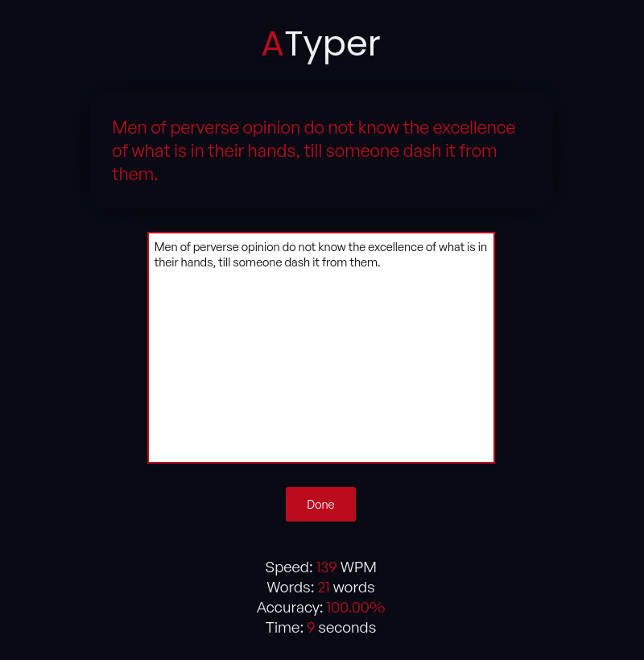

# ATyper

ATyper is a simple web-based typing test application where users can practice their typing skills by typing out provided quotes.

## Features

- **Real-time Typing Test**: Start typing and see your typing speed (in words per minute), accuracy, and time taken in real-time.
- **Random Quotes**: Each typing session presents a random quote fetched from the Quotable API.
- **User-Friendly Interface**: Clean and intuitive interface for a seamless typing experience.

## Preview



## Getting Started

To get started with ATyper, simply clone this repository to your local machine and open the `index.html` file in your web browser.

```bash
git clone https://github.com/apatheticdamn/atyper.git
cd ATyper
```
